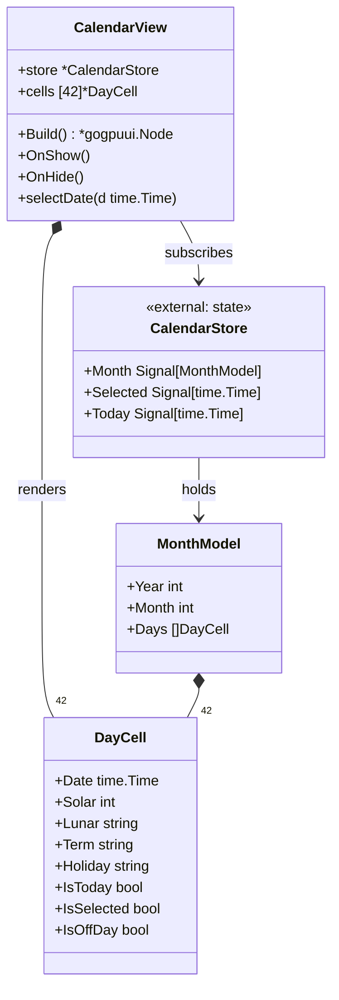
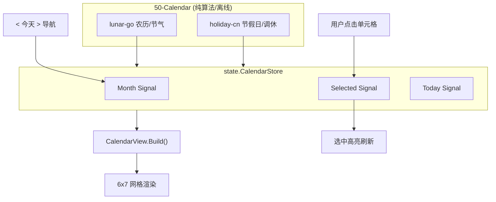
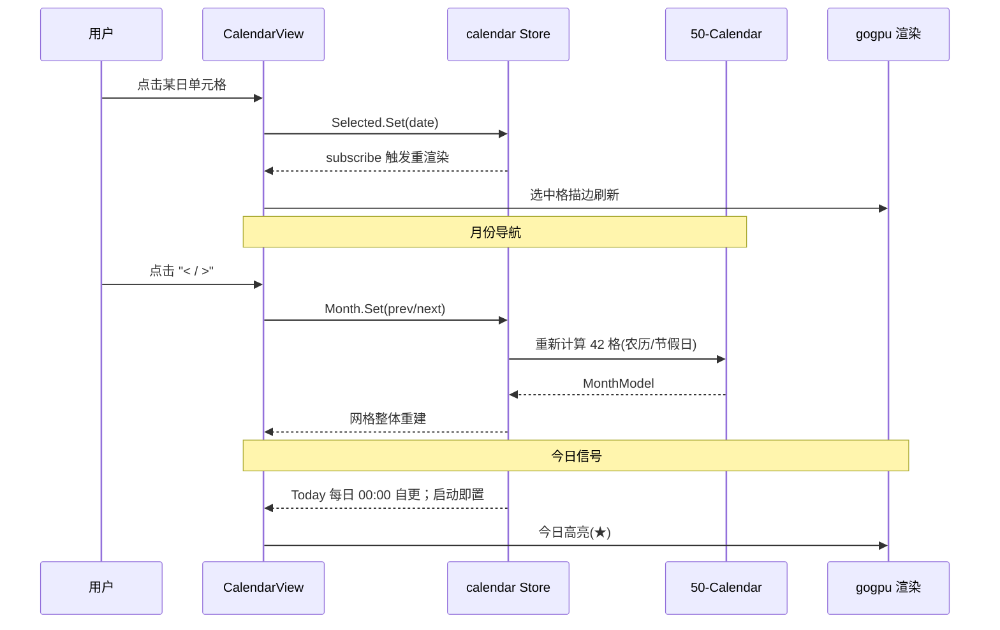
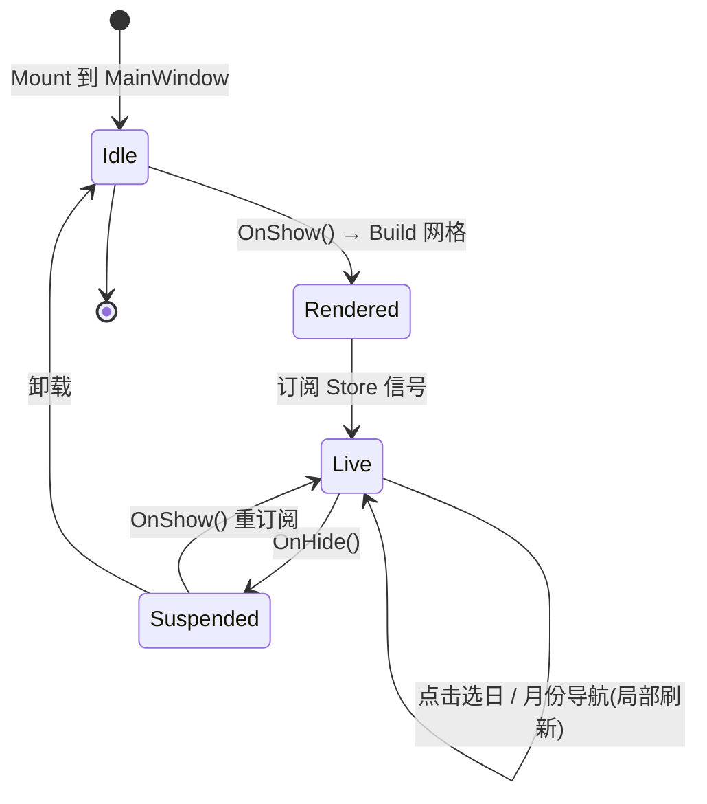

# CalendarView 详细设计 — 90-UI（MVP）

> 版本：v1.0-draft ｜ 最后更新：2026-07-07 ｜ 范围：**MVP（v1.0）** ｜ 包：`internal/ui`
> 关联：ADR-05a（lunar-go）、ADR-05c（holiday-cn）、`30-State`、`50-Calendar`

---

## 1. 📦 package 设计

- **包名**：`ui`（Go package `internal/ui`）。
- **职责一句话**：在 MainWindow 根容器内渲染**月视图（6×7 网格）**，展示公历日期 + 农历/节气/节假日标记，并以 Signal 绑定 `calendar` Store 实现今日/选中高亮与点击交互。
- **依赖方向**：
  - 依赖：`internal/state`（calendar Store：当前月、选中日、今日 Signal）、`internal/calendar`（month/lunar/holiday 领域计算，经 Store 间接取数）、`internal/theme`（文本/高亮配色）。
  - 被依赖：仅被 `MainWindow.Mount` 引用。
- **对外公开符号**：`CalendarView`（struct）、`NewCalendarView(store *state.CalendarStore) *CalendarView`、`(*CalendarView) Build() *gogpuui.Node`、`(*CalendarView) OnShow()`、`(*CalendarView) OnHide()`。
- **边界**：
  - 归它管：网格布局、单元格绘制、今日/选中高亮、农历/节气/节假日小字标注、点击选日。
  - 不归它管：农历算法本身（`calendar/lunar`）、节假日数据获取（`calendar/holiday`）、窗口显隐（`MainWindow`）、持久化。

## 2. 📐 UML 类图



## 3. 🔄 数据流图



**数据源**：`lunar-go`（离线算法）、`holiday-cn`（嵌入 JSON，离线）、用户交互（点击/导航）。**汇点**：gogpu 组件树渲染。

## 4. 🎨 UI 原型图（ASCII）

月历网格样例（含农历小字，★今日，●选中，休=休息日调休标记）：

```
   2026年7月          <  今天  >
   日   一   二   三   四   五   六
 ┌────┬────┬────┬────┬────┬────┬────┐
 │28  │29  │30  │ 1  │ 2  │ 3  │ 4  │
 │廿三│廿四│廿五│六月│初二│初三│初四│
 ├────┼────┼────┼────┼────┼────┼────┤
 │ 5  │ 6  │ 7★ │ 8  │ 9  │10  │11  │
 │初五│初六│小暑│初八│初九│初十│十一│
 ├────┼────┼────┼────┼────┼────┼────┤
 │12  │13  │14  │15  │16  │17  │18  │
 │十二│十三│十四│十五│十六│十七│十八│
 ├────┼────┼────┼────┼────┼────┼────┤
 │19  │20  │21  │22  │23  │24  │25  │
 │十九│二十│廿一│廿二│廿三│廿四│廿五│
 ├────┼────┼────┼────┼────┼────┼────┤
 │26  │27  │28  │29  │30  │31  │    │
 │廿六│廿七│廿八│廿九│三十│闰六│    │
 ├────┼────┼────┼────┼────┼────┼────┤
 │    │    │    │    │    │    │    │
 │    │    │    │    │    │    │    │
 └────┴────┴────┴────┴────┴�────┴────┘
   ※ 今日(7号)浅色圆点高亮；选中格描边
   ※ 调休"班"以红字、休以灰字（节假日数据）
```

## 5. 🗂 数据库设计

**N/A** — CalendarView 仅做渲染；农历/节假日数据来自 `50-Calendar` 的领域计算与嵌入 JSON，不在此层落盘。

## 6. 📡 Event / Signal 流程



- **emit**：`Selected.Set`、`Month.Set`（均由 UI/定时器触发）；`Today` 由 Store 初始化与每日定时器更新。
- **subscribe**：`CalendarView.Build` 内订阅 `Month`/`Selected`/`Today`，任一变更触发局部重渲染（gogpu Signal 自动 diff）。

## 7. 🔌 Plugin API

**N/A（MVP）** — 月历标注为内置数据（农历/节假日），未来插件可在 `DayCell` 上叠加自定义标记（如日程圆点），v1.4 经 `80-Plugin` 事件总线注入，MVP 不定义。

## 8. 🧩 Feature 生命周期



## 9. 📖 Go 接口定义

```go
package ui

import (
    "time"

    "github.com/shaolei/DeskCalendar/internal/state"
    gogpuui "github.com/deskcalendar/gogpu/ui"
)

// DayCell 单个日期格的展示模型（由 calendar 领域计算后填充）。
type DayCell struct {
    Date      time.Time
    Solar     int    // 公历日
    Lunar     string // 农历小字，如 "小暑"/"初七"
    Term      string // 节气名（仅节气日非空）
    Holiday   string // 节假日/调休名（如 "国庆"/"班"）
    IsToday   bool
    IsSelected bool
    IsOffDay  bool   // 法定休息日（灰字）
}

// MonthModel 当前月的完整渲染模型（固定 6×7=42 格）。
type MonthModel struct {
    Year  int
    Month int
    Days  [42]DayCell
}

// CalendarView 月视图。store 来自 state 包（Signal 响应式）。
type CalendarView struct {
    store *state.CalendarStore
    cells [42]DayCell
}

func NewCalendarView(store *state.CalendarStore) *CalendarView
func (v *CalendarView) Build() *gogpuui.Node
func (v *CalendarView) OnShow()
func (v *CalendarView) OnHide()

// selectDate 由单元格点击回调调用，写入 Selected Signal。
func (v *CalendarView) selectDate(d time.Time)
```

> 注：`state.CalendarStore` 在 `30-State` 定义为 `type CalendarStore struct { Month signal.Signal[MonthModel]; Selected signal.Signal[time.Time]; Today signal.Signal[time.Time] }`，本视图仅消费。

## 10. 🚀 每个 Milestone 的任务拆分

- **v1.0（MVP，待实现）**：
  - T1：6×7 网格组件树构建（`Build`），固定 42 格含上/下月补白 — 验收：任意月份正确对齐星期列。
  - T2：绑定 `calendar` Store 三个 Signal，今日/选中高亮渲染 — 验收：启动显示当日★；点击任意格描边。
  - T3：农历/节气/节假日小字标注（调用 `50-Calendar` 经 Store 注入的 `MonthModel`）— 验收：小暑、国庆等标注正确（lunar-go + holiday-cn，离线）。
  - T4：`< / >` 月份导航 + "今天" 按钮回到当月 — 验收：导航后网格整体刷新且选中态保持逻辑正确。
- **v1.1 ~ v1.3**：无 CalendarView 核心改动（农历/节假日持续准确即可）。
- **v1.4**：开放 DayCell 标记注入点供插件叠加日程圆点。
- **v1.5**：N/A。
