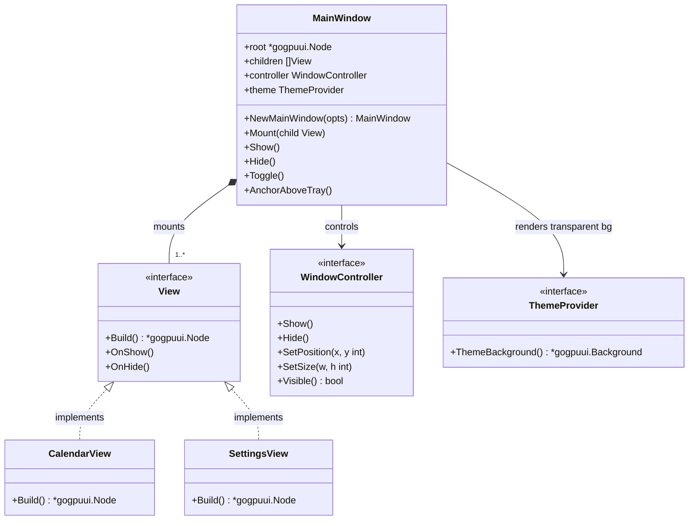
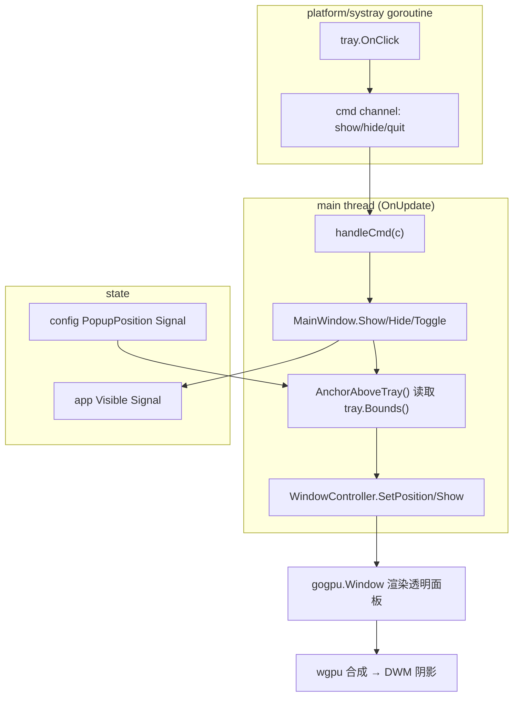
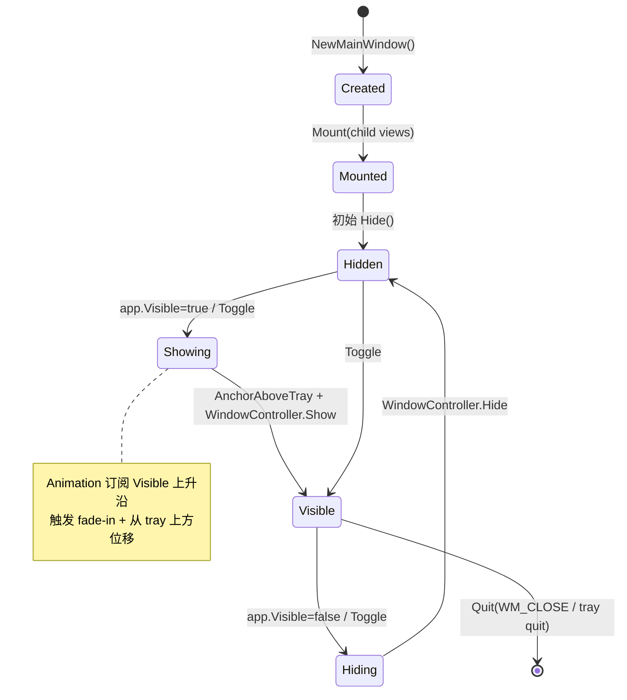

# MainWindow 详细设计 — 90-UI（MVP）

> 版本：v1.0-draft ｜ 最后更新：2026-07-07 ｜ 范围：**MVP（v1.0）** ｜ 包：`internal/ui`
> 关联：ADR-03（透明圆角 + 每像素 alpha）、ADR-02（双循环）、`01-总体架构.md` §2/§3

---

## 1. 📦 package 设计

- **包名**：`ui`（Go package `internal/ui`）。
- **职责一句话**：作为整个弹窗的**透明根容器（root container）**，负责面板尺寸、圆角透明外观、显隐生命周期，并以组件树（component tree）挂载所有子视图（CalendarView / Settings / Post-MVP 的 TodoView / WeatherView）。
- **依赖方向**：
  - 依赖：`internal/state`（config / app 状态 Signal、Store）、`internal/calendar`（MVP 领域数据，经 Store 间接）、`internal/platform`（tray Bounds 用于定位，`WindowController`）、`internal/theme`（`ThemeBackground` 透明渲染）。
  - 被依赖：仅被 `internal/app`（装配 `ui.NewApp()` 与 `desktop.Run`）依赖；子视图（CalendarView 等）持有 `MainWindow` 引用或经 `MainWindow.Mount(child)` 挂载。
- **对外公开符号**：`MainWindow`（struct）、`NewMainWindow(opts Options) (*MainWindow, error)`、`(*MainWindow) Mount(child View)`、`(*MainWindow) Show()`、`(*MainWindow) Hide()`、`(*MainWindow) Toggle()`、`(*MainWindow) AnchorAboveTray()`、`(*MainWindow) Root() *gogpuui.Node`。
- **边界**：
  - 归它管：窗口显隐、尺寸、位置（托盘上方锚定）、根容器透明外观、子视图挂载编排。
  - 不归它管：具体月历网格绘制（CalendarView）、业务数据获取（feature 包）、托盘消息循环（platform/systray）、配置读写落盘（infra/config）。

## 2. 📐 UML 类图



## 3. 🔄 数据流图



**数据源**：用户点击托盘（channel 命令）、`config` Store（`PopupPosition` 决定锚定策略）。**汇点**：`gogpu.Window` → GPU 合成。

## 4. 🎨 UI 原型图（ASCII）

整体面板布局（MVP，透明圆角，托盘上方弹出）：

```
        ┌──────────────────────────────┐  ← 圆角透明根容器(每像素 alpha)
        │ [DeskCalendar]        _ □ ✕  │  ← 标题栏(可隐藏/拖拽区, 极简)
        ├──────────────────────────────┤
        │  2026年7月        < 今天 >    │  ← 月份导航(CalendarView 头部)
        │ 日 一 二 三 四 五 六          │
        │       1  2  3  4  5           │  6×7 月历网格(CalendarView)
        │  6  7★ 8  9 10 11 12          │  ★=今日高亮
        │ 13 14 15 16 17 18 19          │  农历小字在格内下方
        │ 20 21 22 23 24 25 26          │
        │ 27 28 29 30 31                │
        ├──────────────────────────────┤
        │ [设置 ⚙]                      │  ← MVP 最小入口(打开 Settings)
        └──────────────────────────────┘
              ▲ 锚定在托盘图标正上方
        ┌─────┴─────┐
        │ [🕒 tray] │  ← Windows 任务栏托盘时钟
        └───────────┘
```

## 5. 🗂 数据库设计

**N/A** — MainWindow 为纯内存视图根容器，不持有任何持久化数据；定位/尺寸/显隐均为运行时状态，不落盘。配置持久化由 `infra/config` + `config` Store 负责（见 `Settings.md` §5）。

## 6. 📡 Event / Signal 流程

```mermaid
sequenceDiagram
    participant Tray as systray goroutine
    participant Ch as cmdCh
    participant App as gogpu.App.OnUpdate
    participant MW as MainWindow
    participant WC as WindowController
    participant Sig as app.Visible Signal

    Tray->>Ch: OnClick → CmdToggle
    App->>Ch: select cmd (每帧)
    App->>MW: Toggle()
    alt 当前隐藏
        MW->>MW: AnchorAboveTray() 读 tray.Bounds()
        MW->>WC: SetPosition(x,y); Show()
        MW->>Sig: Set(true)
        MW->>MW: children.OnShow()
    else 当前显示
        MW->>WC: Hide()
        MW->>Sig: Set(false)
        MW->>MW: children.OnHide()
    end
    WC->>WC: RequestRedraw() 唤醒空闲主循环
```

- **emit**：`tray.OnClick`（仅发 channel）；`MainWindow` 在显隐后写入 `app.Visible` Signal。
- **subscribe**：Animation 模块订阅 `app.Visible` 以触发淡入/位移（`Animation.md` §6）；CalendarView 订阅自身 `selected`/`month` Signal。

## 7. 🔌 Plugin API

**N/A（MVP）** — MainWindow 是视图宿主，不直接对插件暴露钩子。未来 `80-Plugin` 的视图扩展点（如"在面板底部挂载自定义卡片"）将在 v1.4 通过 `MainWindow.Mount(pluginView View)` 间接支持，MVP 不定义。

## 8. 🧩 Feature 生命周期



## 9. 📖 Go 接口定义

```go
package ui

import (
    "github.com/shaolei/DeskCalendar/internal/theme"
    gogpuui "github.com/deskcalendar/gogpu/ui"
)

// WindowController 抽象 platform 提供的窗口操作，便于 UI 层 mock/测试。
// 实现在 internal/platform（封装 gogpu 主窗口），严格只在主线程调用。
type WindowController interface {
    Show()
    Hide()
    SetPosition(x, y int)
    SetSize(w, h int)
    Visible() bool
}

// View 是所有可挂载子视图的统一契约（CalendarView/Settings/TodoView/WeatherView 均实现）。
type View interface {
    Build() *gogpuui.Node // 构建并返回组件树根节点
    OnShow()              // 面板显示时回调（如刷新当前月）
    OnHide()              // 面板隐藏时回调
}

// Options 装配 MainWindow 所需依赖。
type Options struct {
    Controller WindowController
    Theme      theme.Provider
    PopupPos   PopupPosition // 来自 config Store
}

// PopupPosition 弹窗锚定策略（与 config 一致）。
type PopupPosition int

const (
    PopupAboveTray PopupPosition = iota // 托盘图标正上方（默认）
    PopupCenterScreen                   // 屏幕居中
)

// MainWindow 透明根容器。
type MainWindow struct {
    root      *gogpuui.Node
    children  []View
    controller WindowController
    theme     theme.Provider
    opts      Options
}

func NewMainWindow(opts Options) (*MainWindow, error)
func (m *MainWindow) Mount(child View)
func (m *MainWindow) Show()
func (m *MainWindow) Hide()
func (m *MainWindow) Toggle()
// AnchorAboveTray 读取 tray.Bounds() 计算面板左上角，
// 定位到托盘图标正上方居中：x = bx + bw/2 - panelW/2, y = by - panelH - margin。
func (m *MainWindow) AnchorAboveTray() error
func (m *MainWindow) Root() *gogpuui.Node
```

## 10. 🚀 每个 Milestone 的任务拆分

- **v1.0（MVP，待实现）**：
  - T1：`NewMainWindow` 用 `gogpu.Frameless` + `ThemeBackground()` 搭建透明圆角根容器（路径 D 下改为 gg 绘制 + 原生分层窗口，渲染模式由 `internal/platform` 本地枚举簿记）— 验收：`CGO_ENABLED=0` 编译；每像素 alpha 圆角 + DWM 阴影生效（复用 ADR-03 POC）。
  - T2：绑定 `tray.OnClick` channel 命令 → `MainWindow.Toggle()`，`OnUpdate` 主线程消费 — 验收：点击托盘 50ms 内显隐，焦点不抢（G1）。
  - T3：`AnchorAboveTray` 依据 `tray.Bounds()` 定位到托盘上方；`PopupPosition=center` 时居中 — 验收：多屏/DPI 下不越界（平台层配合）。
  - T4：挂载 CalendarView 与 Settings 两子视图，编排根容器组件树 — 验收：组件树可渲染，子视图 `OnShow/OnHide` 正确触发。
- **v1.1**：MainWindow 增加 `Mount(TodoView)`，底部卡片区扩展（不影响核心）。
- **v1.2**：MainWindow 增加 `Mount(WeatherView)`（顶部卡片）。
- **v1.3**：主题切换时 `ThemeBackground()` 热更新不重建窗口。
- **v1.4**：开放 `Mount(pluginView View)` 供插件注入视图。
- **v1.5**：N/A（发布相关，无 MainWindow 改动）。
