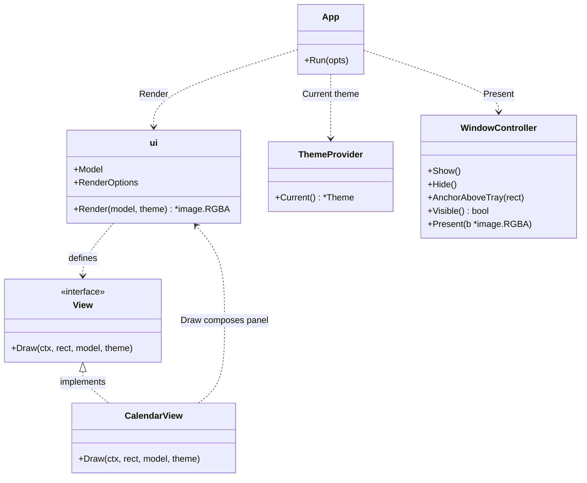
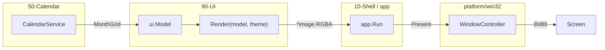
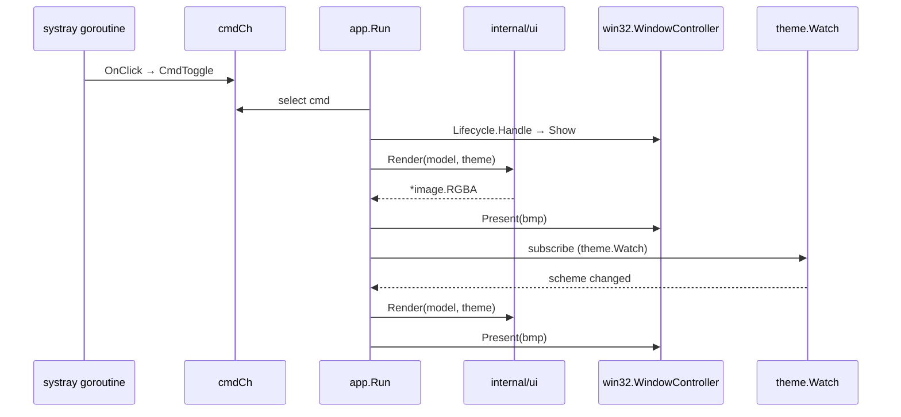
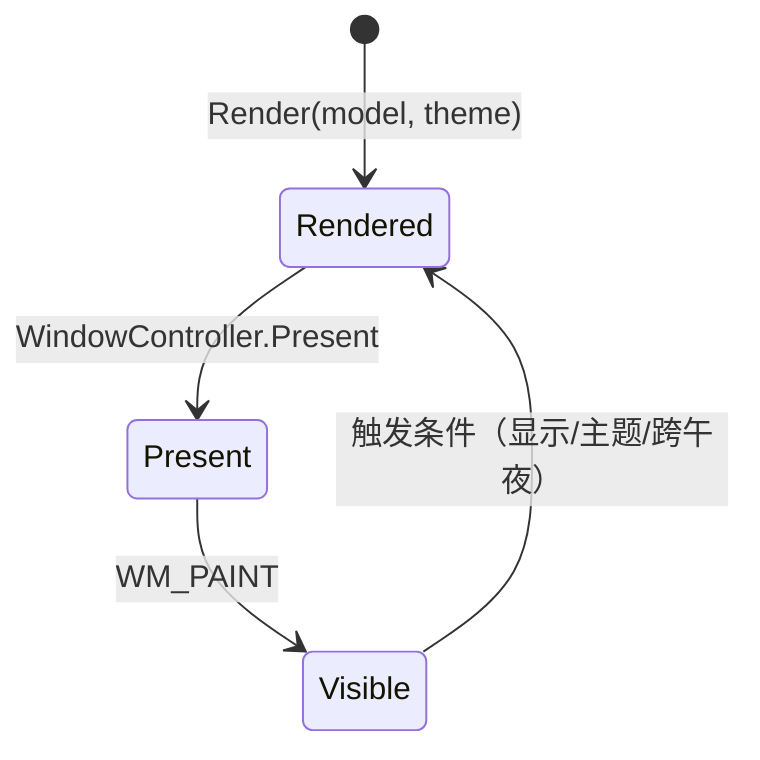

# MainWindow 详细设计 — 90-UI（MVP / Path D）

> 版本：v1.0-PathD ｜ 最后更新：2026-07-09 ｜ 范围：**MVP（v1.0）** ｜ 包：`internal/ui`
> 关联：ADR-03（透明圆角 + 每像素 alpha，MVP 降级为不透明方角）、ADR-02（双循环）、`01-总体架构.md` §2/§3

---

## 1. 📦 package 设计

- **包名**：`ui`（Go package `internal/ui`）。
- **职责一句话**：把日历面板**光栅化**为 `*image.RGBA`；MVP 不再持有组件树或窗口，只负责纯函数渲染。
- **依赖方向**：
  - 依赖：`internal/calendar`（`MonthGrid` 值对象）、`internal/theme`（`*Theme` 值对象）、`github.com/gogpu/gg`（CPU 光栅）。
  - 被依赖：仅被 `internal/app` 调用；`internal/platform/win32` 消费像素，不依赖 `ui`。
- **对外公开符号**：`Model`、`Cell`、`RenderOptions`、`Render`、`View`、`CalendarView`。
- **边界**：
  - 归它管：面板尺寸、背景填充、子视图编排、`Render` 输出。
  - 不归它管：窗口显隐/定位（`app`/`win32`）、托盘菜单（`settings`）、业务数据获取（`calendar`）、配置持久化（`config`）。
- **路径 D 说明**：原设计用 `gogpu/ui` 的 `*Node` 组件树 + `gogpu.Window` GPU 合成。MVP 改为 `gg` CPU 光栅 + `win32` 普通弹窗 `BitBlt`。透明圆角/阴影/DWM 后处理推至 v1.1/v1.3。

---

## 2. 📐 UML 类图



---

## 3. 🔄 数据流图



---

## 4. 🎨 UI 原型图（ASCII）

整体面板布局（MVP，不透明方角弹窗，托盘上方弹出）：

```
        ┌──────────────────────────────┐  ← 不透明方角根容器（MVP 无圆角）
        │  2026年7月                    │  ← 月份标题（CalendarView）
        ├──────────────────────────────┤
        │ 日  一  二  三  四  五  六    │  ← 星期表头
        │ 28  29  30   1   2   3   4  │  ← 6×7 月历网格（补白格灰字）
        │  5   6   7   8   9  10  11  │  ← 7 号为今日（浅蓝底）
        │ ...                          │
        │                              │
        │                              │
        └──────────────────────────────┘
              ▲ 锚定在托盘图标正上方
        ┌─────┴─────┐
        │ [🕒 tray] │  ← Windows 任务栏托盘时钟
        └───────────┘
```

---

## 5. 🗂 数据库设计

**N/A** — `ui` 为纯函数渲染层，不持有持久化数据。

---

## 6. 📡 Event / Signal 流程



- `app` 在显隐切换后、系统主题变化后、跨午夜后触发 `Render`。
- `ui` 本身不订阅 Signal，不保持 goroutine，每次调用都全量重光栅。

---

## 7. 🔌 Plugin API

**N/A（MVP）** — `ui` 不对插件暴露。未来 `80-Plugin` 的视图扩展点（如"在面板底部挂载自定义卡片"）将在 v1.4 通过 `app` 侧注入 `ui.Model` 扩展数据，MVP 不定义。

---

## 8. 🧩 Feature 生命周期



- `ui` 无状态；每次 `Render` 独立。
- `View.OnShow/OnHide` 接口保留，MVP 空实现。

---

## 9. 📖 Go 接口定义

```go
package ui

import (
    "image"
    "time"

    "github.com/gogpu/gg"
    "github.com/shaolei/DeskCalendar/internal/calendar"
    "github.com/shaolei/DeskCalendar/internal/theme"
)

// Model / Cell / RenderOptions / Render / View 见 CalendarView.md。
// MainWindow 在 Path D 下不再作为独立实体：其职责由 app.Run 的装配逻辑 + ui.Render 覆盖。

// Render 签名（即原 MainWindow 的「渲染整面板」职责）。
func Render(model Model, opts RenderOptions, th *theme.Theme) *image.RGBA

// View 接口（子视图组合）。
type View interface {
    Draw(dc *gg.Context, rect image.Rectangle, m Model, th *theme.Theme)
    OnShow()
    OnHide()
}

// CalendarView 是 MVP 唯一子视图。
type CalendarView struct{}
func (CalendarView) Draw(dc *gg.Context, rect image.Rectangle, m Model, th *theme.Theme)
func (CalendarView) OnShow()
func (CalendarView) OnHide()
```

---

## 10. 🚀 每个 Milestone 的任务拆分

- **v1.0（MVP，已实现）**：
  - T1：`Render(model, theme) → *image.RGBA`（gg 绘实心不透明方角面板）— 验收：`CGO_ENABLED=0` 编译；图像尺寸正确；alpha 全 255。
  - T2：缓冲 → `WindowController.Present` 推送（经 `win32` DIBSection）— 验收：弹窗出真实日历画面。
  - T3：状态变更（显隐/主题/跨午夜）→ `app` 重调 `Render` — 验收：每次切换显示都刷新到最新月/主题。
  - T4：子视图 `Draw` 组合（`CalendarView`）— 验收：标题 + 表头 + 网格一次绘制。
- **v1.1**：`DwmSetWindowAttribute(DWMWA_WINDOW_CORNER_PREFERENCE, DWMWCP_ROUND)` 零成本圆角；调休「班」标记。
- **v1.2**：接入 `Animator` 实现淡入/位移（需分层窗或 DWM 过渡）。
- **v1.3**：主题切换时热更新不重建窗口；皮肤/字号自定义。
- **v1.4**：开放 `Model` 扩展点供插件注入自定义卡片。
- **v1.5**：N/A。
