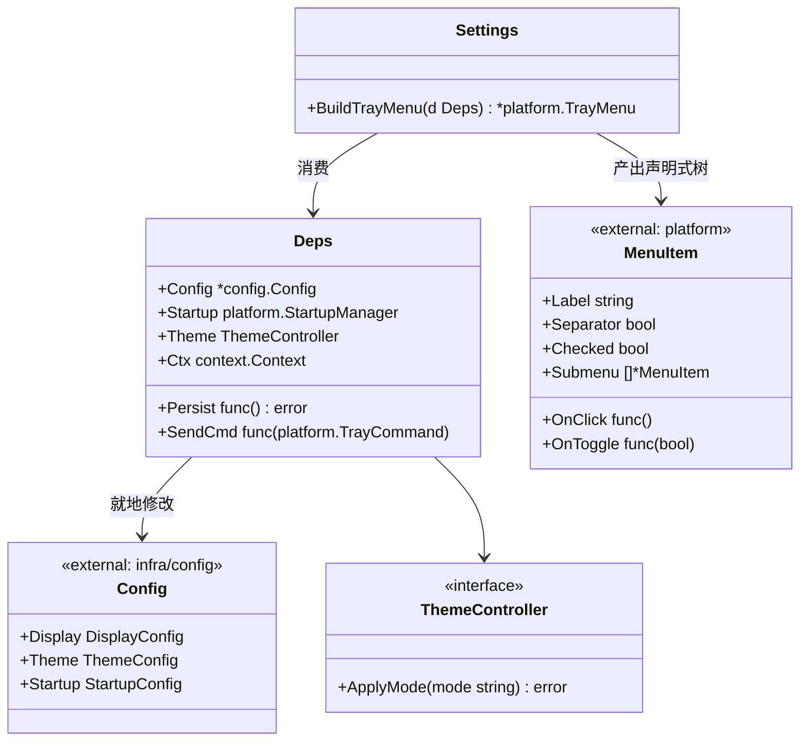
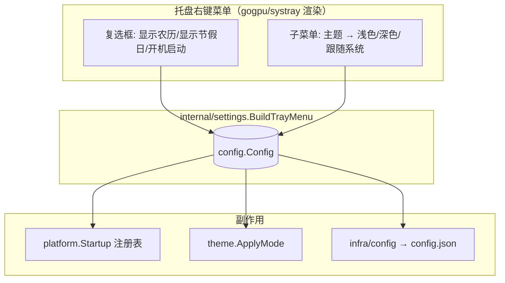
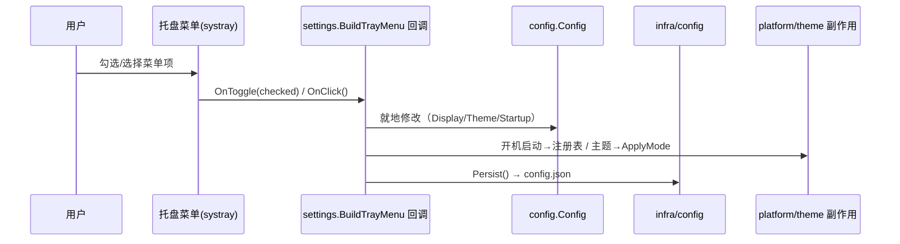
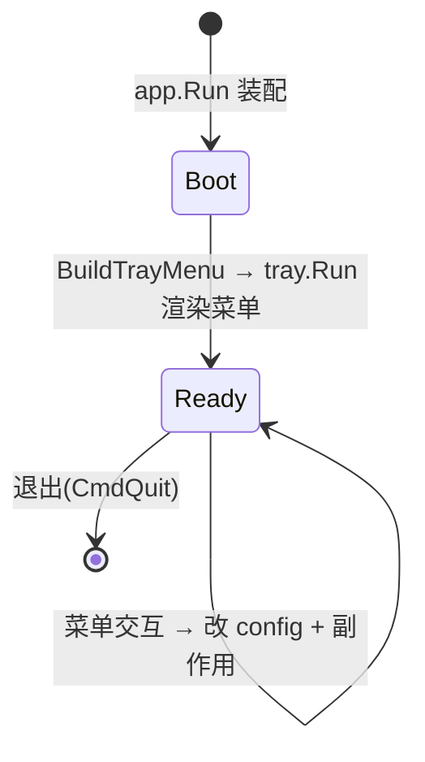

# Settings 详细设计 — 90-UI（MVP，路径 D / ADR-08）

> 版本：v1.0-PathD ｜ 最后更新：2026-07-09 ｜ 范围：**MVP（v1.0）托盘右键菜单** ｜ 包：`internal/settings`
> 关联：ADR-06（零 CGO）、ADR-08（降级脱离 gogpu/ui 上游阻塞）、`01-总体架构`、`03-项目目录规范` §4（config.json）、`20-Platform/Startup`（开机自启）
> 标注：**MVP**。

---

## 1. 📦 package 设计

- **包名**：`settings`（Go package `internal/settings`）。
- **职责一句话**：构建托盘右键菜单（声明式 `platform.MenuItem` 树），把菜单交互接到 `config` 持久化与副作用（注册表自启 / 主题应用）。
- **依赖方向**（ADR-07）：
  - 依赖：`internal/infra/config`（落盘）、`internal/platform`（托盘菜单渲染 + 自启注册表）、`internal/theme`（主题应用）。
  - 被依赖：仅 `internal/app`（装配期调用 `BuildTrayMenu`）。
- **对外公开符号**：`BuildTrayMenu(deps Deps) *platform.TrayMenu`、`Deps`、`ThemeController`。
- **边界**：
  - 归它管：菜单结构、交互回调（改 config、触发副作用、推送托盘命令）。
  - 不归它管：systray 渲染实现（归 `platform`）、注册表写入实现（归 `platform/startup`）、主题渲染实现（归 `theme`）、config.json 文件 IO（归 `infra/config`）。
- **⚠️ 与旧设计的关键差异（ADR-08）**：原方案 `SettingsView.Build` 用 `gogpu/ui` 控件树在**独立窗**渲染三项设置。路径 D 下 `gogpu/ui` 已降级，MVP 设置改为**托盘右键菜单**（`gogpu/systray` 的 `AddCheckbox`/`AddSubmenu`），无需独立窗。原 `SettingsView` 独立窗降级为 **v1.3 后备**（见 #119）。

## 2. 📐 UML 类图



## 3. 🔄 数据流图



**数据源**：用户在托盘右键菜单的勾选 / 选择。**汇点**：注册表（自启）、theme 实时配色、config.json 持久化。

## 4. 🎨 菜单原型（ASCII）

```
┌─────────────────────────┐
│ 显示/隐藏                │   ← OnClick → CmdToggle
├─────────────────────────┤
│ ☑ 显示农历               │   ← OnToggle → config.Display.ShowLunar
│ ☑ 显示节假日             │   ← OnToggle → config.Display.ShowHoliday
│ ☐ 开机启动               │   ← OnToggle → 注册表 + config.Startup.AutoStart
│ 主题 ▸                   │   ← AddSubmenu
│   ○ 浅色                 │      OnClick → mode=light + ApplyMode + 持久化
│   ○ 深色                 │      OnClick → mode=dark  + ApplyMode + 持久化
│   ○ 跟随系统             │      OnClick → mode=system + ApplyMode + 持久化
├─────────────────────────┤
│ 退出                     │   ← OnClick → CmdQuit
└─────────────────────────┘
```

> 勾选即时生效并写入 `config.json`；重启后由 `config.Load` 恢复。

## 5. 🗂 数据库设计

**N/A** — Settings 不落数据库；配置以 JSON 文件持久化（`%AppData%/DeskCalendar/config.json`），由 `infra/config` 负责。MVP 结构（相对旧设计新增 `display`）：

```json
{
  "version": 1,
  "theme":   { "mode": "system", "accent": "#4C8DFF" },
  "window":  { "corner_radius": 16, "shadow": true, "position_mode": "tray" },
  "startup": { "auto_start": false },
  "display": { "show_lunar": true, "show_holiday": true }
}
```

> `display.show_lunar` / `display.show_holiday` 为 MVP 新增（T1 的「显示农历 / 显示节假日」开关）。

## 6. 📡 Event / Signal 流程



- **emit**：菜单回调写 `config` 字段 + 触发副作用（注册表 / 主题）。
- **subscribe**：`infra/config` 落盘；`platform/startup`、`theme` 各自应用副作用。

## 7. 🔌 Plugin API

**N/A（MVP）** — 设置为内置托盘菜单；未来插件可注册额外菜单项（v1.4 经 `80-Plugin`）。

## 8. 🧩 Feature 生命周期



菜单在进程生命周期内常驻（随托盘泵存在），无需显隐状态机。

## 9. 📖 Go 接口定义

```go
package settings

import (
    "context"

    "github.com/shaolei/DeskCalendar/internal/infra/config"
    "github.com/shaolei/DeskCalendar/internal/platform"
)

// ThemeController 主题应用最小接口（*theme.ThemeProvider 满足）。
type ThemeController interface {
    ApplyMode(mode string) error // "system" | "light" | "dark"
}

// Deps 构建托盘菜单所需依赖（app 装配期注入）。
type Deps struct {
    Config  *config.Config          // 可变指针：回调就地修改并落盘
    Persist func() error            // 写 config.json
    Startup platform.StartupManager // nil → 仅改 config
    Theme   ThemeController         // nil → 仅改 config
    SendCmd func(platform.TrayCommand) // 向主循环推送命令（显示/隐藏、退出）
    Ctx     context.Context
}

// BuildTrayMenu 构造托盘右键菜单声明式树（见 §4）。
func BuildTrayMenu(d Deps) *platform.TrayMenu
```

**`platform.MenuItem` / `TrayMenu`**（声明式菜单模型，`platform` 经 `gogpu/systray` 渲染）：

```go
type MenuItem struct {
    Label    string
    Separator bool
    Checked  bool
    OnClick  func()
    OnToggle func(checked bool)
    Submenu  []*MenuItem
}
type TrayMenu struct { Items []*MenuItem }
```

**`theme.ThemeProvider.ApplyMode(mode string) error`**（新增，供主题子菜单调用）：`system`→清除覆盖跟随系统；`light`/`dark`→固定覆盖。

## 10. 🚀 每个 Milestone 的任务拆分

- **v1.0（MVP，✅ 已实现）**：
  - T1 `托盘右键菜单 AddCheckbox（显示农历 / 显示节假日 / 开机启动）` — ✅
  - T2 `主题切换 AddSubmenu（浅色 / 深色 / 跟随系统）` — ✅
  - T3 `菜单项变更 → config 落盘 + 副作用` — ✅（persist + 注册表 / ApplyMode）
  - T4 `副作用联动` — ✅（自启写 HKCU Run、主题跟随系统、锚定由 #9 窗口重锚）
- **v1.2 天气**：新增 `weather_api_key` 输入项（和风 key），填则切 `QWeatherProvider`。
- **v1.3 主题换肤**：主题项扩展「自定义皮肤」入口。
- **v1.3 后备（#119，⏳ 不实现）**：原 `SettingsView` 独立窗降级为后备——仅当设置复杂到托盘菜单放不下（皮肤/字号/周起始日）时，复用自拥窗口工厂开第二 gg 弹窗。MVP 仅预留机制（托盘菜单已覆盖全部 MVP 设置）。
- **v1.4 插件系统**：开放插件设置项注入点。
