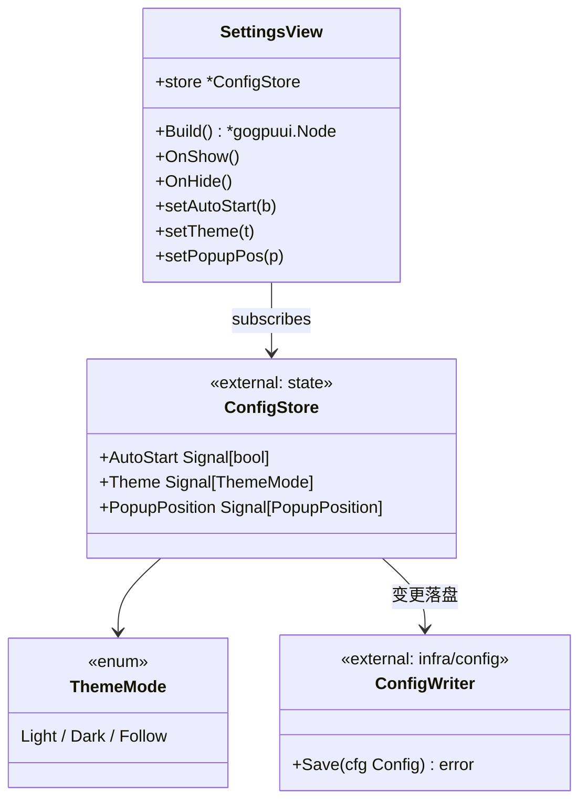
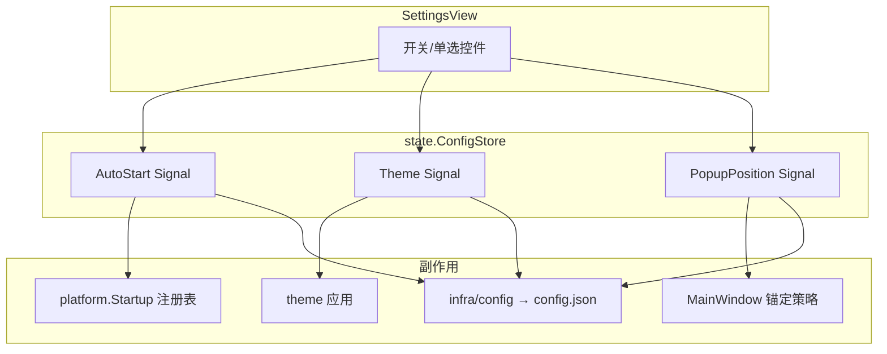
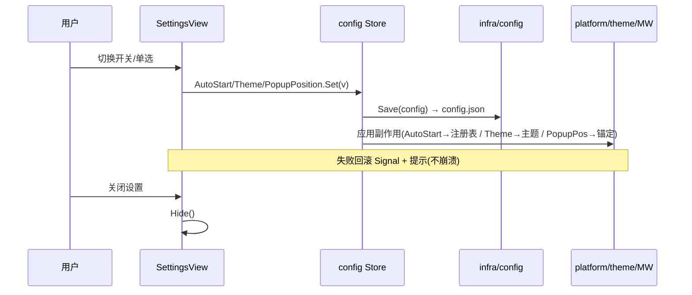
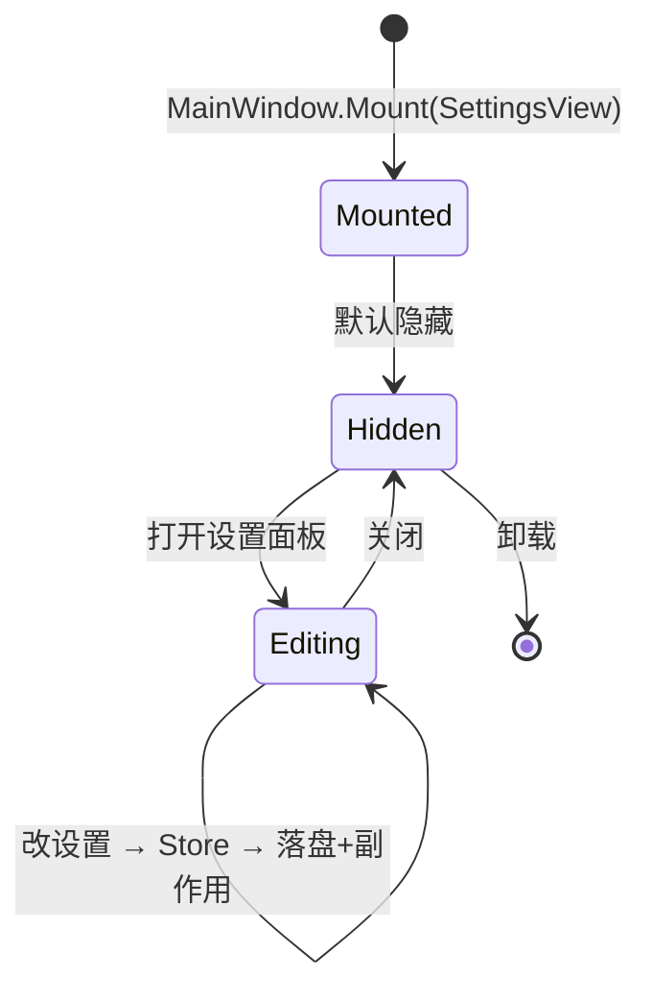

# Settings 详细设计 — 90-UI（MVP）

> 版本：v1.0-draft ｜ 最后更新：2026-07-07 ｜ 范围：**MVP（v1.0）最小设置** ｜ 包：`internal/ui`
> 关联：ADR-06（零 CGO）、`01-总体架构`、`03-项目目录规范` §4（config.json）、`20-Platform/Startup`（开机自启）
> 标注：**MVP**。

---

## 1. 📦 package 设计

- **包名**：`ui`（Go package `internal/ui`）。
- **职责一句话**：在 MainWindow 内渲染**最小设置面板**，提供开机自启开关、主题（浅/深/跟随）、弹窗位置（托盘上方/居中）三项设置，并绑定 `config` Store，变更即持久化到 `%AppData%/DeskCalendar/config.json`。
- **依赖方向**：
  - 依赖：`internal/state`（config Store：AutoStart / Theme / PopupPosition Signal）、`internal/infra/config`（落盘读写）、`internal/platform`（应用开机自启注册表）、`internal/theme`（主题应用）。
  - 被依赖：仅 `MainWindow.Mount`（通常经设置入口打开）。
- **对外公开符号**：`SettingsView`（struct）、`NewSettingsView(store *state.ConfigStore) *SettingsView`、`(*SettingsView) Build() *gogpuui.Node`、`(*SettingsView) OnShow()`、`(*SettingsView) OnHide()`。
- **边界**：
  - 归它管：三项设置的 UI 控件、即时反馈、经 Store 持久化。
  - 不归它管：注册表写入实现（归 `platform/startup`）、主题渲染实现（归 `theme`）、config.json 文件 IO 细节（归 `infra/config`）。

## 2. 📐 UML 类图



## 3. 🔄 数据流图



**数据源**：用户设置操作。**汇点**：注册表（自启）、theme 渲染、MainWindow 定位、config.json 持久化。

## 4. 🎨 UI 原型图（ASCII）

设置面板（MVP 最小三项）：

```
 ┌──────────────────────────────────┐
 │ 设置                             │
 ├──────────────────────────────────┤
 │ 开机自启                          │
 │   [开 ●─────] 关                 │  ← 开关
 ├──────────────────────────────────┤
 │ 主题                              │
 │   (●) 浅色  ( ) 深色  ( ) 跟随系统│  ← 单选
 ├──────────────────────────────────┤
 │ 弹窗位置                          │
 │   (●) 托盘上方  ( ) 屏幕居中      │  ← 单选
 ├──────────────────────────────────┤
 │ [关闭]                           │
 └──────────────────────────────────┘
   变更即时生效并写入 config.json
```

## 5. 🗂 数据库设计

**N/A** — Settings 不落数据库；配置以 JSON 文件持久化（`%AppData%/DeskCalendar/config.json`），由 `infra/config` 负责。结构示意：

```json
{
  "auto_start": false,
  "theme": "follow",
  "popup_position": "above_tray",
  "weather_api_key": ""
}
```

> 说明：`weather_api_key` 在 v1.2 由 WeatherView/Settings 扩展填写，MVP 仅前三项可见。文件 IO 与校验归 `infra/config`，本视图只通过 `config` Store 读写。

## 6. 📡 Event / Signal 流程



- **emit**：`AutoStart.Set` / `Theme.Set` / `PopupPosition.Set`（UI 触发）。
- **subscribe**：`infra/config` 订阅落盘；`platform/startup`、`theme`、`MainWindow` 各自订阅对应 Signal 应用副作用。

## 7. 🔌 Plugin API

**N/A（MVP）** — 设置为内置面板；未来插件可注册额外设置项（v1.4 经 `80-Plugin`），本视图不额外定义钩子。

## 8. 🧩 Feature 生命周期



## 9. 📖 Go 接口定义

```go
package ui

import (
    "github.com/shaolei/DeskCalendar/internal/state"
    gogpuui "github.com/deskcalendar/gogpu/ui"
)

// ThemeMode 主题模式（与 config/theme 一致）。
type ThemeMode int

const (
    ThemeLight ThemeMode = iota
    ThemeDark
    ThemeFollow
)

// PopupPosition 弹窗锚定（与 MainWindow 一致）。
type PopupPosition int

const (
    PopupAboveTray PopupPosition = iota
    PopupCenterScreen
)

// SettingsView 最小设置面板。
type SettingsView struct {
    store *state.ConfigStore
}

func NewSettingsView(store *state.ConfigStore) *SettingsView
func (v *SettingsView) Build() *gogpuui.Node
func (v *SettingsView) OnShow()
func (v *SettingsView) OnHide()

// 回调由控件事件绑定，写入 config Store（副作用：注册表/主题/锚定/落盘）。
func (v *SettingsView) setAutoStart(on bool)
func (v *SettingsView) setTheme(m ThemeMode)
func (v *SettingsView) setPopupPos(p PopupPosition)
```

> 注：`ConfigStore` 在 `30-State` 定义为持有 `AutoStart/Theme/PopupPosition` 三个 `Signal`，本视图消费并回写。

## 10. 🚀 每个 Milestone 的任务拆分

- **v1.0（MVP，待实现）**：
  - T1：`SettingsView.Build` 三项控件组件树 — 验收：开关/单选可渲染可交互。
  - T2：绑定 `config` Store，变更即写 Signal — 验收：切换后 Store 值更新。
  - T3：经 `infra/config` 持久化到 `config.json` — 验收：重启后设置保留。
  - T4：副作用联动 — 验收：开机自启写 `HKCU\...\Run`（仅当前用户）；主题跟随系统；弹窗位置切换生效。
- **v1.1**：无改动（Todo 不依赖设置）。
- **v1.2**：新增 `weather_api_key` 输入项（和风 key），填则切 `QWeatherProvider`。
- **v1.3**：主题项扩展"自定义皮肤"入口。
- **v1.4**：开放插件设置项注入点。
- **v1.5**：N/A。
