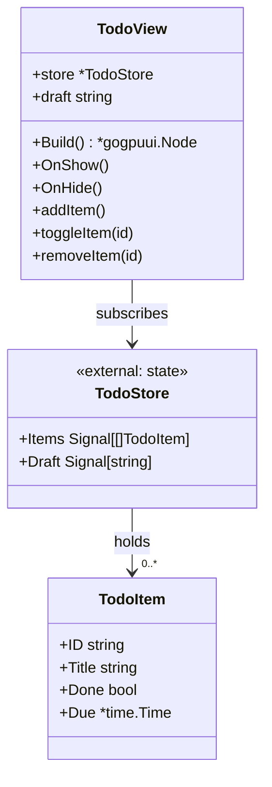
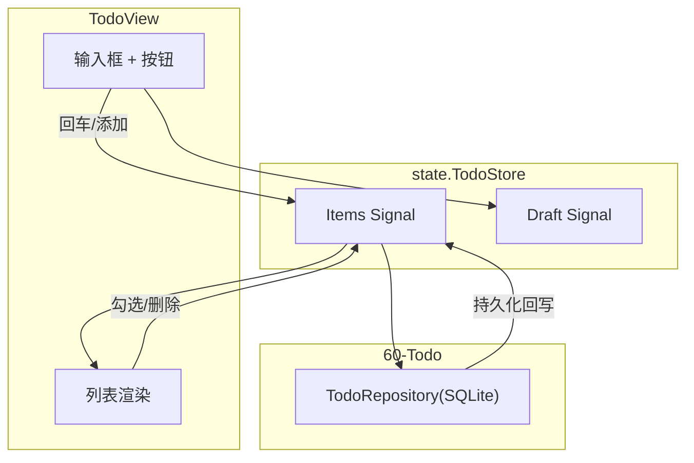
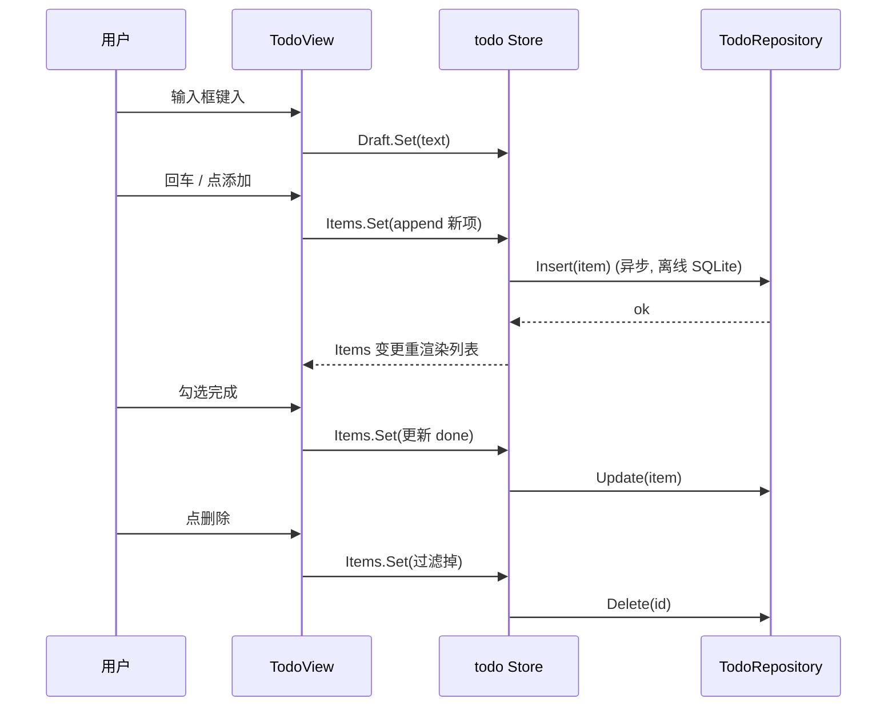
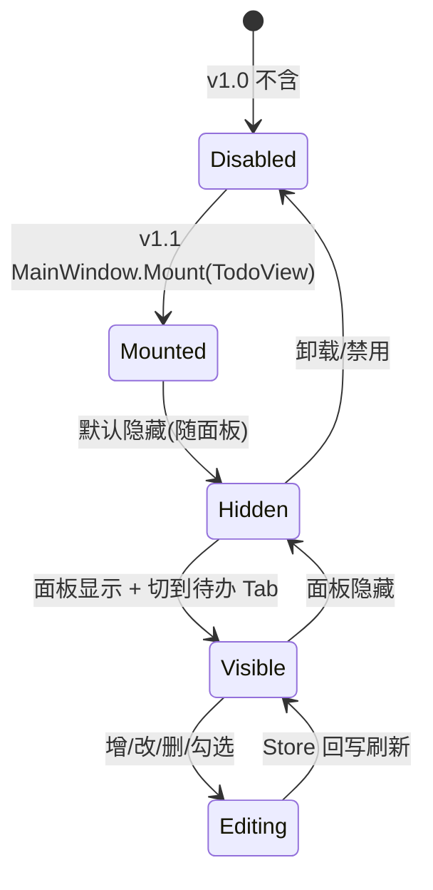

# TodoView 详细设计 — 90-UI（Post-MVP）

> 版本：v1.1-draft ｜ 最后更新：2026-07-07 ｜ 范围：**Post-MVP（v1.1）** ｜ 包：`internal/ui`
> 关联：ADR-05（数据源无关）、`60-Todo`、`30-State`
> 标注：**本模块不在 MVP 范围，v1.1 排期**（见 `00-项目介绍.md` 路线图）。

---

## 1. 📦 package 设计

- **包名**：`ui`（Go package `internal/ui`）。
- **职责一句话**：在 MainWindow 内渲染**待办列表视图**，绑定 `todo` Store，提供增 / 删 / 改 / 完成切换交互。
- **依赖方向**：
  - 依赖：`internal/state`（todo Store：列表、草稿 Signal）、`internal/todo`（model/sqlite 持久化，经 Store 间接）、`internal/theme`。
  - 被依赖：仅 `MainWindow.Mount`（v1.1 起）。
- **对外公开符号**：`TodoView`（struct）、`NewTodoView(store *state.TodoStore) *TodoView`、`(*TodoView) Build() *gogpuui.Node`、`(*TodoView) OnShow()`、`(*TodoView) OnHide()`。
- **边界**：
  - 归它管：列表渲染、输入框、增删改按钮、完成勾选的 UI 行为。
  - 不归它管：待办数据持久化（SQLite，归 `60-Todo`）、提醒调度（归 `60-Todo` Reminder）、窗口显隐。

## 2. 📐 UML 类图



## 3. 🔄 数据流图



**数据源**：用户输入（增/改/删）、SQLite（`60-Todo`，本地离线）。**汇点**：gogpu 列表渲染 + SQLite 持久化。

## 4. 🎨 UI 原型图（ASCII）

待办面板（MVP 主面板切换/分页显示，或作为独立 Tab）：

```
 ┌──────────────────────────────────┐
 │ 待办清单              [+ 新建]    │
 ├──────────────────────────────────┤
 │ [✓] 买牛奶               [🗑]    │  ← 已完成(划线)
 │ [ ] 写周报           17:00 [🗑]  │  ← 未完成 + 截止时间
 │ [ ] 给妈妈打电话             [🗑] │
 │──────────────────────────────────│
 │ > ________________________        │  ← 草稿输入框
 │   输入后回车或点 [+ 新建] 添加    │
 └──────────────────────────────────┘
   共 3 项 · 已完成 1 · 未完成 2
```

## 5. 🗂 数据库设计

**N/A（本视图层）** — TodoView 不直连数据库；表结构由 `60-Todo` 定义。此处仅说明视图消费的数据形态：

```sql
-- 归属 60-Todo（示意，非本文件落地）
CREATE TABLE todos (
    id    TEXT PRIMARY KEY,
    title TEXT NOT NULL,
    done  INTEGER NOT NULL DEFAULT 0,
    due   TEXT,                     -- RFC3339，可空
    ord   INTEGER NOT NULL          -- 排序
);
```

## 6. 📡 Event / Signal 流程



- **emit**：`Draft.Set`、`Items.Set`（UI 触发）；Repository 写入为副作用。
- **subscribe**：`TodoView.Build` 订阅 `Items`/`Draft`，变更即重渲染。

## 7. 🔌 Plugin API

**N/A（v1.1）** — 待办视图为内置功能；未来插件可订阅 `todo` 事件（新增/完成）做联动提醒，v1.4 经 `80-Plugin` 暴露，本视图不额外定义钩子。

## 8. 🧩 Feature 生命周期



## 9. 📖 Go 接口定义

```go
package ui

import (
    "time"

    "github.com/shaolei/DeskCalendar/internal/state"
    gogpuui "github.com/deskcalendar/gogpu/ui"
)

// TodoItem 展示模型（与 60-Todo model 对齐，经 Store 注入）。
type TodoItem struct {
    ID    string
    Title string
    Done  bool
    Due   *time.Time
}

// TodoView 待办列表视图。
type TodoView struct {
    store *state.TodoStore
    draft string
}

func NewTodoView(store *state.TodoStore) *TodoView
func (v *TodoView) Build() *gogpuui.Node
func (v *TodoView) OnShow()
func (v *TodoView) OnHide()

// 以下回调由组件事件绑定，写入 todo Store（Repository 异步落盘）。
func (v *TodoView) addItem()
func (v *TodoView) toggleItem(id string)
func (v *TodoView) removeItem(id string)
```

## 10. 🚀 每个 Milestone 的任务拆分

- **v1.0（MVP）**：**不包含** TodoView（范围外，见路线图）。
- **v1.1（Post-MVP，待实现）**：
  - T1：`TodoView.Build` 列表 + 输入框组件树 — 验收：可渲染列表与草稿框。
  - T2：绑定 `todo` Store，增/删/改/勾选交互写入 Store — 验收：操作后列表实时刷新。
  - T3：经 `60-Todo` 持久化到 SQLite（`%AppData%/DeskCalendar/todo.db`）— 验收：重启后待办保留（离线）。
  - T4：MainWindow 增加 Tab 切换（日历/待办）或独立分页 — 验收：不破坏 MVP 日历主流程。
- **v1.2+**：与 WeatherView 共存于分页；v1.4 开放事件供插件联动。
- **v1.5**：N/A。
