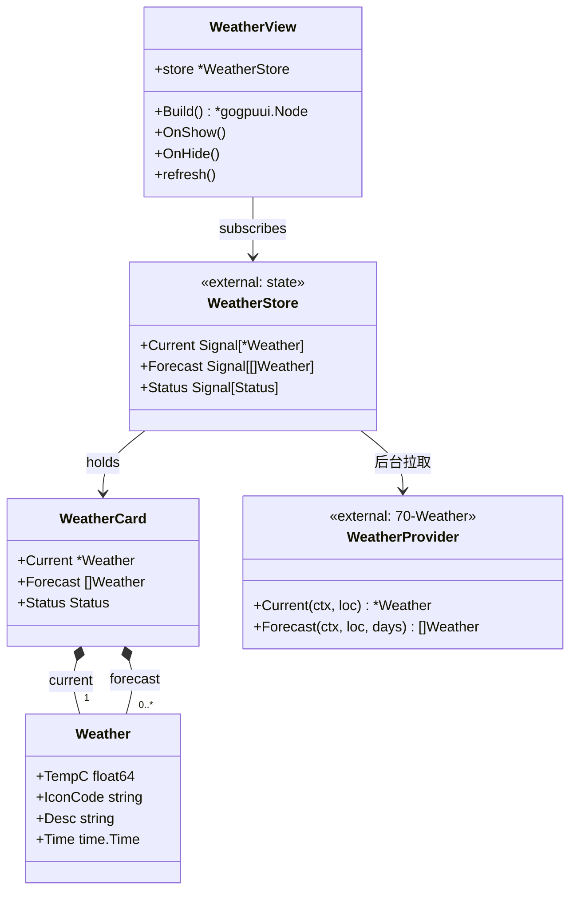
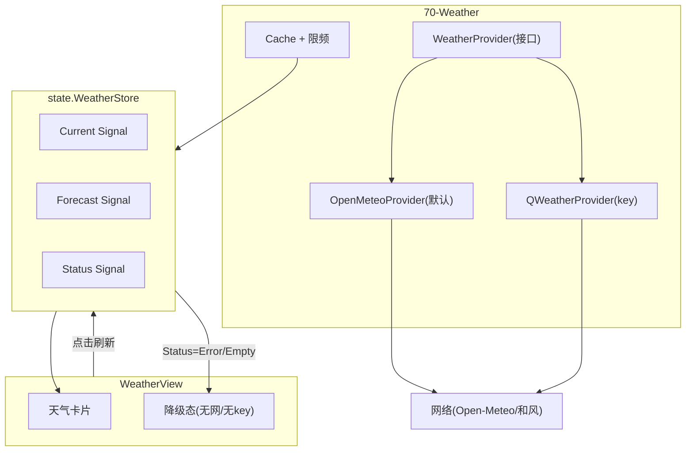
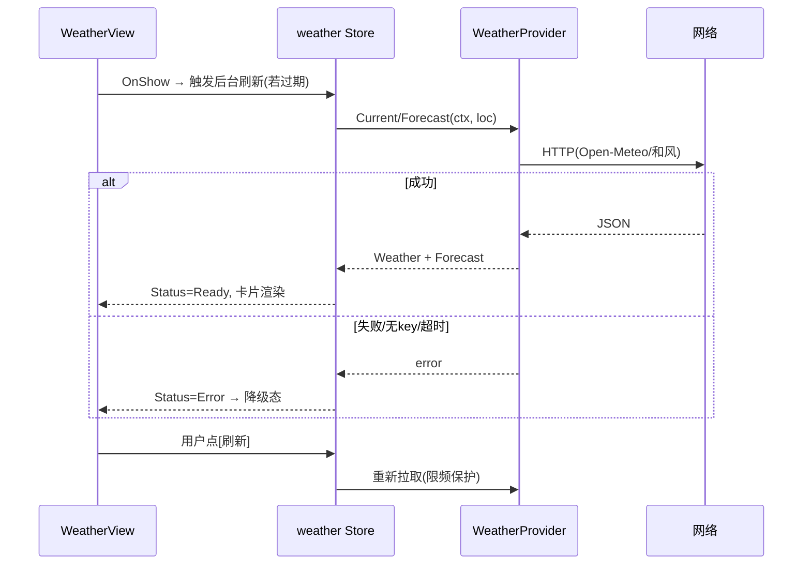
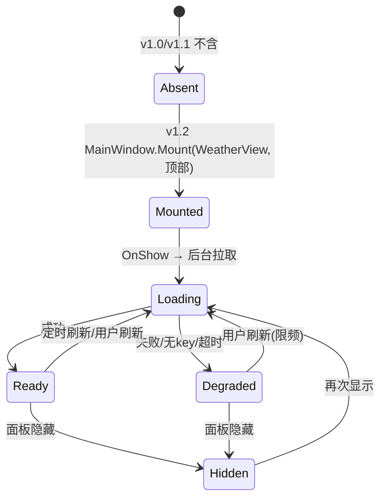

# WeatherView 详细设计 — 90-UI（Post-MVP）

> 版本：v1.2-draft ｜ 最后更新：2026-07-07 ｜ 范围：**Post-MVP（v1.2）** ｜ 包：`internal/ui`
> 关联：ADR-05b（Open-Meteo 默认 / 和风可配）、`70-Weather`、`30-State`
> 标注：**本模块不在 MVP 范围，v1.2 排期**；天气为唯一在线源且必须优雅降级。

---

## 1. 📦 package 设计

- **包名**：`ui`（Go package `internal/ui`）。
- **职责一句话**：在 MainWindow 顶部渲染**天气卡片**（当前温度 / 图标 / 短期预报），绑定 `weather` Store，并在无网 / 无 key / 加载中时显示降级态，绝不阻塞日历主流程。
- **依赖方向**：
  - 依赖：`internal/state`（weather Store：当前、预报、状态 Signal）、`internal/weather`（`WeatherProvider` 接口与实现，经 Store 间接）、`internal/theme`（图标/配色）。
  - 被依赖：仅 `MainWindow.Mount`（v1.2 起，通常置于面板顶部）。
- **对外公开符号**：`WeatherView`（struct）、`NewWeatherView(store *state.WeatherStore) *WeatherView`、`(*WeatherView) Build() *gogpuui.Node`、`(*WeatherView) OnShow()`、`(*WeatherView) OnHide()`。
- **边界**：
  - 归它管：天气卡片渲染、图标映射、降级态展示、点击刷新。
  - 不归它管：天气网络获取与缓存（归 `70-Weather` Provider/Cache）、key 配置（归 Settings/config）、窗口显隐。

## 2. 📐 UML 类图



## 3. 🔄 数据流图



**数据源**：网络（`WeatherProvider`，异步 + 缓存 + 限频）。**汇点**：gogpu 卡片渲染；断网/无 key 走 `Deg` 降级。

## 4. 🎨 UI 原型图（ASCII）

天气卡片（面板顶部，含降级态两态示意）：

```
正常态：
 ┌──────────────────────────────────┐
 │ ☀ 28°C  晴    北京               │  ← 当前:图标+温度+描述+城市
 │ 今日 28°/20°  明日 30°/22° 后天… │  ← 短期预报(3~7天小字)
 │ [刷新]                           │
 └──────────────────────────────────┘

降级态(无网 / 未配置 / 加载中)：
 ┌──────────────────────────────────┐
 │ 🌥 天气暂不可用                   │  ← 不显示温度, 仅占位
 │ （离线或网络不可达，日历不受影响） │
 └──────────────────────────────────┘
```

## 5. 🗂 数据库设计

**N/A（本视图层）** — WeatherView 不落盘；`70-Weather` 以内存缓存 + 可选磁盘缓存实现离线降级，表/文件结构归该模块。

## 6. 📡 Event / Signal 流程



- **emit**：`Status.Set(Ready/Loading/Error)`、`Current.Set`、`Forecast.Set`（由后台拉取触发）。
- **subscribe**：`WeatherView.Build` 订阅三 Signal；`Error` 时渲染降级态，**不阻塞日历**。

## 7. 🔌 Plugin API

**N/A（v1.2）** — 天气为内置模块；未来插件可读取 `WeatherStore` 当前值做联动（如"降雨提醒"），v1.4 经 `80-Plugin` 暴露只读事件，本视图不额外定义钩子。

## 8. 🧩 Feature 生命周期



## 9. 📖 Go 接口定义

```go
package ui

import (
    "context"
    "time"

    "github.com/shaolei/DeskCalendar/internal/state"
    gogpuui "github.com/deskcalendar/gogpu/ui"
)

// Status 天气加载状态（驱动降级态）。
type Status int

const (
    StatusLoading Status = iota
    StatusReady
    StatusError
)

// Weather 单条天气展示模型（对齐 70-Weather）。
type Weather struct {
    TempC    float64
    IconCode string // 映射为内置图标字体
    Desc     string
    Time     time.Time
}

// WeatherView 天气卡片视图（顶部）。
type WeatherView struct {
    store *state.WeatherStore
}

func NewWeatherView(store *state.WeatherStore) *WeatherView
func (v *WeatherView) Build() *gogpuui.Node
func (v *WeatherView) OnShow()
func (v *WeatherView) OnHide()

// refresh 由[刷新]按钮/定时触发，写入 Status=Loading 并请求 Store 后台拉取。
func (v *WeatherView) refresh()
```

> 注：`WeatherProvider` 接口见 ADR-05b：`Current(ctx, loc) (*Weather, error)` / `Forecast(ctx, loc, days) ([]*Weather, error)`，默认 `OpenMeteoProvider`，配 key 切 `QWeatherProvider`，本视图仅消费其产出。

## 10. 🚀 每个 Milestone 的任务拆分

- **v1.0 / v1.1**：**不包含** WeatherView（范围外）。
- **v1.2（Post-MVP，待实现）**：
  - T1：`WeatherView.Build` 卡片组件树 + 图标映射 — 验收：可渲染当前温度/图标/短期预报。
  - T2：绑定 `weather` Store 三 Signal，正常态渲染 — 验收：Open-Meteo 免 key 取到实况。
  - T3：降级态（无网/无 key/超时）渲染且不阻塞日历 — 验收：断网时仅显示"天气暂不可用"，月历照常。
  - T4：`70-Weather` 异步 + 缓存 + 限频；Settings 填 key 自动切和风 — 验收：填 key 后精度升级且调用方无改动。
- **v1.3+**：主题切换时天气图标配色同步。
- **v1.4**：只读事件供插件联动。
- **v1.5**：N/A。
