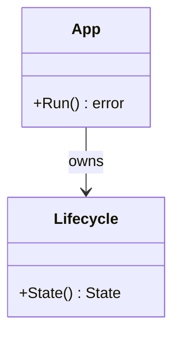

# _模板与写作规范（模块文档契约）

> 本文是所有 `10-*` ~ `100-*` 模块文档的**强制写作契约**。每个模块文档必须包含以下 **10 个章节**，顺序固定。若某节对该模块确实不适用，必须显式写 `N/A` 并给出理由，不得省略。

---

## 10 节标准结构

### 1. 📦 package 设计
- 包名、所在目录（`internal/...`）。
- 职责一句话概括。
- **依赖方向**：依赖哪些包、被哪些包依赖（画依赖箭头或列表）。
- 对外暴露的公开符号（类型 / 函数 / 接口）。
- 与相邻模块的边界（什么归它管、什么不归它管）。

### 2. 📐 UML 类图
- 用 `mermaid classDiagram` 给出核心类型与关系。
- 标注关系：`-->` 关联、`*--` 组合、`o--` 聚合、`..>` 依赖。
- 至少覆盖 aggregate root 与关键 value object。

### 3. 🔄 数据流图
- 用 `mermaid flowchart` 描述该模块**内部**与**跨模块**的数据流向。
- 标明数据源（用户操作 / 定时器 / 网络 / 文件）与汇点（UI / Store / DB）。

### 4. 🎨 UI 原型图（ASCII）
- 用 ASCII / 框图画出该模块相关界面或组件布局。
- 能看出区域划分、对齐、层级即可，不必精确像素。

### 5. 🗂 数据库设计
- 适用时给 `CREATE TABLE` SQL（SQLite 语法）。
- 标注主键、外键、索引、字段含义。
- 不适用写 `N/A` 并说明（如纯内存模块）。

### 6. 📡 Event / Signal 流程
- 列出该模块涉及的 `Signal`（gogpu/ui 响应式原语）与领域事件。
- 给出流转图（`mermaid sequenceDiagram` 或 `flowchart`）。
- 标注谁 emit、谁 subscribe、触发什么副作用。

### 7. 🔌 Plugin API
- 该模块对插件暴露的钩子 / 接口（如适用）。
- 给出插件侧可见的接口或事件名。
- 不适用写 `N/A`（如 Platform 底层）。

### 8. 🧩 Feature 生命周期
- 该模块功能从 **注册 → 初始化 → 启动 → 显隐 → 销毁** 的状态机 / 时序。
- 用 `mermaid stateDiagram-v2` 或 `flowchart`。

### 9. 📖 Go 接口定义
- 给出核心 `interface` 与关键 `struct` 的 **真实 Go 签名**（可编译风格）。
- 含 `error` 返回、`context.Context` 首参（跨 IO 时）。
- 不要伪代码；要能直接粘进 `.go` 文件。

### 10. 🚀 每个 Milestone 的任务拆分
- 按 `v1.0 / v1.1 / v1.2 / v1.3 / v1.4 / v1.5` 列出该模块任务。
- 每项含：任务描述 + 验收标准（可验证）。
- 标注 MVP（v1.0）已实现 / 待实现。

---

## 质量底线

- 内容必须**具体、可落地**，禁止占位符 / lorem ipsum / "TODO 补充"。
- 图用 mermaid；ASCII 原型要能看出布局。
- 体现 **MVP vs 路线图**范围：MVP 模块写"已实现（spike 验证）/ 待实现"，路线图模块标注 `Post-MVP`。
- 中文撰写，术语中英并存（Signal / Provider / Store / Aggregate 等保留英文）。

---

## 已拍板决策（写文档时必须遵守）

- **ADR-01**：UI 用 `gogpu/ui`（Signal 响应式，wgpu GPU 渲染，零 CGO）。
- **ADR-02**：托盘用 `gogpu/systray`，独立 goroutine 跑 `systray.Run()`，与主线程 `desktop.Run` 双消息循环（spike 已验证不冲突）。
- **ADR-03**：窗口无边框 + 每像素 alpha 透明 + 圆角 + DWM 阴影（路径 D 下由 gg + 原生分层窗口实现）；渲染模式由 `internal/platform` 本地 `RenderMode`(Auto/CPU/GPU) 枚举簿记，不引用 fork 不存在的 gogpu 渲染模式常量。
- **ADR-04**：跳过 Mica 毛玻璃；用自绘渐变圆角还原观感。Acrylic 同理非必需。
- **ADR-05**：农历 = `lunar-go`（纯 Go·MIT）；节假日 = `holiday-cn`（纯 Go·MIT），每年构建期烘焙一次 + 可选运行时刷新；天气 = 非 MVP，`WeatherProvider` 接口就绪，默认 Open-Meteo（免 key），填 key 自动切和风。
- **ADR-06**：Go 1.25+，`CGO_ENABLED=0`。

## gogpu 关键 API 事实（供写接口 / 生命周期章节参考）

```go
// 应用装配（main / internal/app）
gogpuApp := gogpu.NewApp(gogpu.Frameless, ...)   // 无边框 + 透明
uiApp := ui.NewApp()
go tray.Run()                                    // 独立 goroutine
desktop.Run(gogpuApp, uiApp)                     // 主线程，内部 runtime.LockOSThread

// 主线程窗口操作（仅在 OnUpdate 中调用）
win := gogpuApp.PrimaryWindow()
win.Show()
win.Hide()
win.SetPosition(x, y)
win.SetSize(w, h)

// 跨线程命令：tray.OnClick 只发 channel，主线程 OnUpdate 消费
tray.OnClick(func() { cmdCh <- CmdToggle })
gogpuApp.OnUpdate(func() {
    select { case c := <-cmdCh: handleCmd(c); default: }
})
gogpuApp.RequestRedraw()                         // 唤醒空闲主循环（非阻塞）

// 托盘定位
b := tray.Bounds()                               // x, y, w, h（屏幕坐标）
// 面板定位到托盘上方：x + w/2 - panelW/2，y - panelH - margin
```

## 例：10 节片段示范（节选，非完整）

**📐 UML 类图**


**📖 Go 接口定义**
```go
type WindowController interface {
    Show()
    Hide()
    SetPosition(x, y int)
    SetSize(w, h int)
    Visible() bool
}
```
